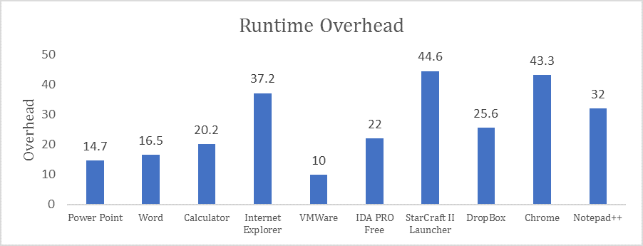
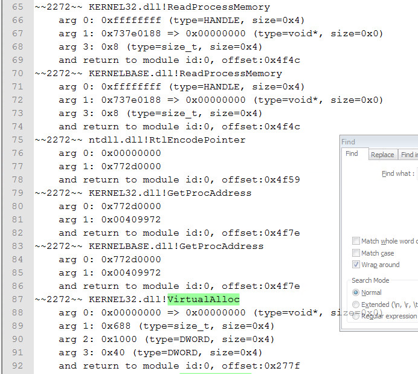
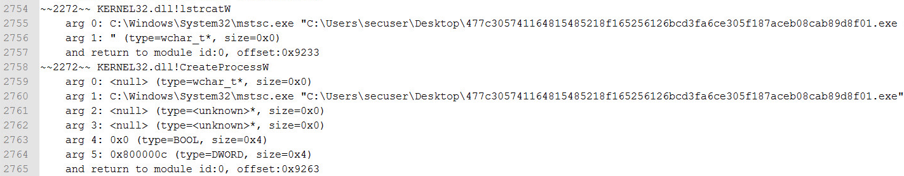
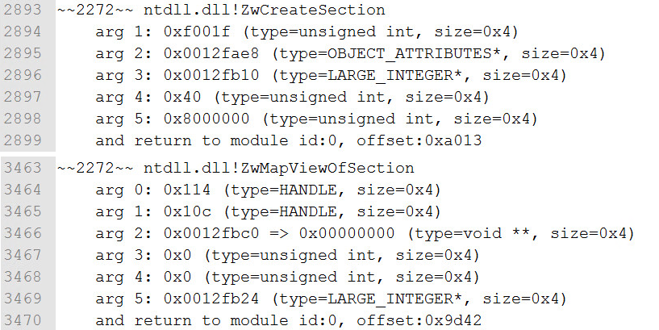
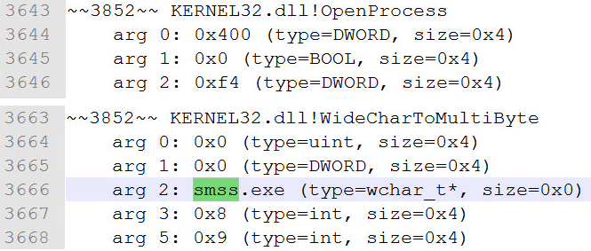
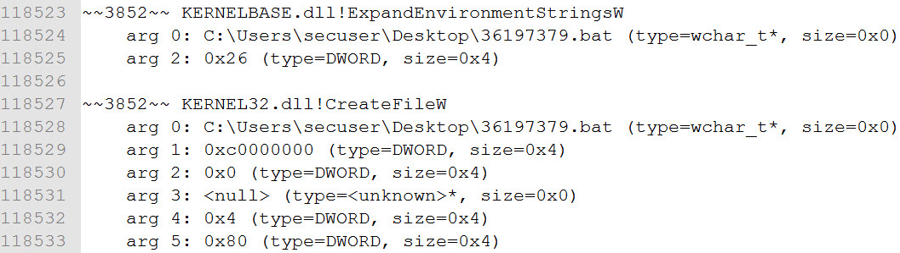
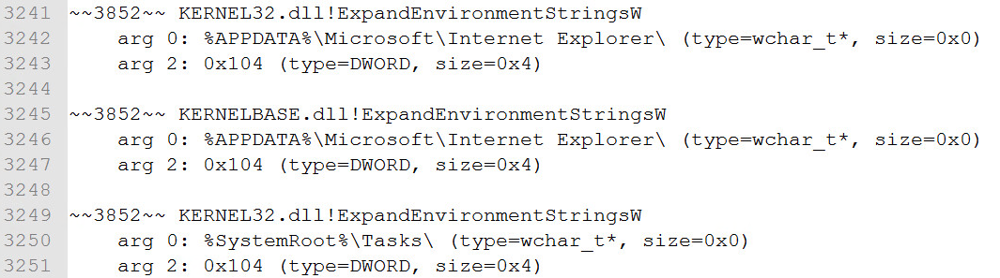
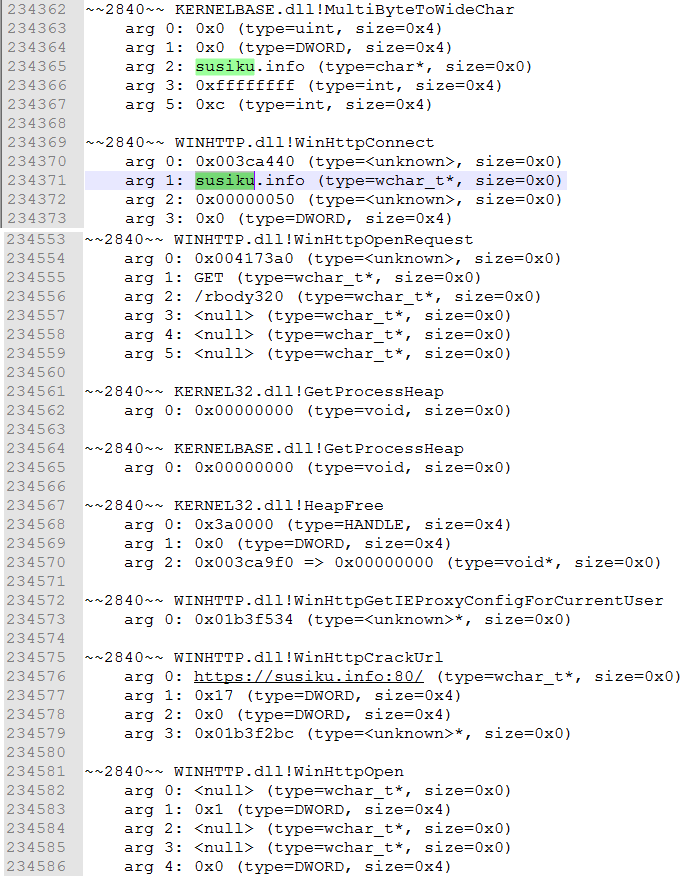

# Drltrace
Drltrace is a dynamic API calls tracer for Windows and Linux applications. Drltrace is built on top of [DynamoRIO](http://www.dynamorio.org/) dynamic binary instrumentation framework. The release build can be downloaded [here](https://github.com/mxmssh/drltrace/releases).

# License

BSD.

# Motivation
<Some intro>
Sophisticated software packers like Themida and Armadillo and of course dozens of unnamed packers written by malware authors plus code & data encryption significantly facilitate (in some cases making it completely impossible) static reverse engineering of such samples thereby delaying detection. In such case, API calls tracing can significantly reduce amount of time required to understand an actual malicious intent and ?????.  <More motivation for API calls tracing>.

While traditional technique of API-hooking technique was successfully implemented in several solutions[link], the approach is well studied by malware authors and can be easily detected and/or bypassed as shown in these works [6] [7]. Moreover, these tools are distributed as standalone heavy-weight GUI applications (as a proprietary products) which are not often easy to integrate within existent malware analysis workflow.

If we look on Linux world, there is a wonderful tool called [ltrace](https://linux.die.net/man/1/ltrace). Using a single bash command, we can easily get the full trace of API calls of a certain executable. 

**Why don’t we have such tool (like ltrace in Linux) for Windows which is also transparent against anti-research tricks used by modern malware?**

It turns that there is a technique that can help us to have such tool for Windows and trace API calls transparently towards executed program. This technique is called dynamic binary instrumentation aka DBI. DBI is a technique of analyzing the behavior of a binary application at runtime through the injection of instrumentation code. 

# Why Drltrace Rock ?
- Fast enough to perform analysis of malicious samples without being detected by time-based anti-research techniques.

- Supports both x86 and x64 (ARM in future).
- Supports both Windows and Linux (macOS in future).
- Supports self-modifying code.
- Supports all types of library linkage (static and dynamic).
- Not-detectable by standard anti-research approaches (anti-hooking, anti-debugging and anti-emulation).
- User can easily add a new function prototype to tell drltrace how to print more details about previously unknown API calls (even about non-system DLLs). External configuration file is used.
- Easy-to-use and modify for your own purposes (no additional package requirements, no heavy-weight GUI interface).
- Open-source (BSD-license), you can freely build & use your own advanced solution on top of drltrace.

# Usage
The usage of drltrace is very simple. A user needs to specify a log directory and a name of a target process in the following way:
```
drltrace -logdir . -- calc.exe
```
That’s all, the framework will inject required DLLs in the target process, starts instrumentation and in parallel will log information about all library calls which are executed in the target process:

```
~~43600~~ msvcrt.dll!__wgetmainargs
    arg 0: 0x010d2364
    arg 1: 0x010d2368
    and return to module id:0, offset:0x193a
~~43600~~ ntdll.dll!EtwEventRegister
    arg 0: 0x002ff994
    arg 1: 0x010d1490
    and return to module id:0, offset:0x157e
~~43600~~ ntdll.dll!EtwEventSetInformation
    arg 0: 0x007b4b40
    arg 1: 0x00000033
    and return to module id:0, offset:0x15a1
~~43600~~ SHELL32.dll!ShellExecuteW
    arg 0: <null> (type=<unknown>, size=0x0)
    arg 1: <null> (type=wchar_t*, size=0x0)
    arg 2: calculator:// (type=wchar_t*, size=0x0)
    arg 3: <null> (type=wchar_t*, size=0x0)
    arg 4: <null> (type=wchar_t*, size=0x0)
    arg 5: 0x1 (type=int, size=0x4)
    and return to module id:0, offset:0x167d
```
The format of the output is simple and can be easily parsed by an external script:
```
~~[thread id]~~ [dll name]![api call name]
arg [arg #]: [value] (type=[Windows type name], size=[size of arg])
and return to module id:[module unique id], offset:[offset in memory]
```
The module unique identifiers table is printed at the end of the log file:

```
Module Table: version 3, count 70
Columns: id, containing_id, start, end, entry, checksum, timestamp, path
  0,   0, 0x010d0000, 0x010da000, 0x010d1b80, 0x0000f752, 0xb5fe3575,  C:\Windows\SysWOW64\calc.exe
  1,   1, 0x6d4c0000, 0x6d621000, 0x6d563940, 0x00136d65, 0x59ce1b0b,  C:\Users\Max\Downloads\drltrace\drltrace\dynamorio\lib32\release\dynamorio.dll
  2,   2, 0x73800000, 0x73975000, 0x7380dbf7, 0x00000000, 0x59ce1b0f,  C:\Users\Max\Downloads\drltrace\drltrace\bin\release/drltracelib.dll
  3,   3, 0x742f0000, 0x742fa000, 0x742f2a00, 0x0000c877, 0x0adc52c1,  C:\Windows\System32\CRYPTBASE.dll
  4,   4, 0x74300000, 0x74320000, 0x7430c9b0, 0x0002c617, 0x245970b4,  C:\Windows\System32\SspiCli.dll
  5,   5, 0x74410000, 0x74431000, 0x74416900, 0x0002a940, 0x88a53c1d,  C:\Windows\System32\GDI32.dll
  6,   6, 0x74440000, 0x74500000, 0x7446fb20, 0x000cc410, 0xd343d532,  C:\Windows\System32\RPCRT4.dll
  7,   7, 0x74500000, 0x74525000, 0x745047d0, 0x00026737, 0xa39c8991,  C:\Windows\System32\IMM32.DLL
  8,   8, 0x74550000, 0x745c7000, 0x7456e8a0, 0x00081857, 0x73b971e1,  C:\Windows\System32\advapi32.dll
  9,   9, 0x748f0000, 0x74929000, 0x748febd0, 0x00045303, 0xa58be652,  C:\Windows\System32\cfgmgr32.dll
 10,  10, 0x74930000, 0x75c78000, 0x74aa09d0, 0x01377aa6, 0x4b39926b,  C:\Windows\System32\SHELL32.dll
```

Drltrace can easily filter out interlibrary calls and print only API calls performed from the main module (or from a heap) of a target application by specifying ```-only_from_app``` option which is very useful in case of applications that generate huge logs. Drltrace also has several useful external scripts to filter API calls for certain library, print only potentially interesting API calls and strings.

# Command line options
```
 -logdir              [     .]  Log directory to print library call data
 -only_from_app       [ false]  Reports only library calls from the app
 -follow_children     [  true]  Trace child processes
 -print_ret_addr      [ false]  Print library call's return address
 -num_unknown_args    [     2]  Number of unknown libcall args to print
 -num_max_args        [     6]  Maximum number of arguments to print
 -default_config      [  true]  Use default config file.
 -config              [    ""]  The path to custom config file.
 -ignore_underscore   [ false]  Ignores library routine names starting with "_".
 -only_to_lib         [    ""]  Only reports calls to the library <lib_name>.
 -help                [ false]  Print this message.
 -version             [ false]  Print version number.
 -verbose             [     1]  Change verbosity.
 -use_config          [  true]  Use config file
 ```
# Configuration file syntax
Drltrace supports external configuration files where a user can describe how drltrace should print arguments for certain API calls.
```
HANDLE|CreateRemoteThread|HANDLE|SECURITY_ATTRIBUTES*|size_t|THREAD_START_ROUTINE*|VOID*|DWORD|__out DWORD*
```
Each function argument should be separated by ```|```. The first argument is return type, the second argument is a function name itself and the rest are the function arguments. A token ```__out``` is used to mark output arguments and ```___inout``` is used to mark input+output arguments.

# Malware Analysis Example

Let us show one example of how to use Drltrace for analysis of a recent new version of Gootkit malware dropper. You can find more examples at our Wiki page <TODO LINK>. This example is based on our report available [here](https://drive.google.com/file/d/0BzFSoGMCVlTORUExdF9RTklpX3c/view).

Discovered in the wild in the summer of 2014, GootKit is considered to be one of the more advanced banking Trojans active nowadays. We have undertaken analysis of the most current version of the GootKit dropper. Relying on Drltrace we discovered new advanced anti-research capabilities which is used to bypass detection in virtual machines or sandboxes and improves Gootkit capabilities to ultimately infect more endpoints. Let’s present how Drltrace helped us in detection of these capabilities. 

Starting the process:
```
drltrace.exe -logdir . -print_ret_addr -- 477c305741164815485218f165256126bcd3fa6ce305f187aceb08cab89d8f01.exe
```
After several seconds, we see that the main process breaks up into three child processes. Drltrace will follow child processes and provide logs for all of them:


While files attrib.exe and cmd.exe looks like a standard windows processes, files ```drltrace.mstsc.exe.04076.0000.log```,```drltrace.477c305741164815485218f165256126bcd3fa6ce305f187aceb08cab89d8f01.003376.000.log``` look suspicious. Let’s look in the log file of the main process.

At the beginning we see Gootkit allocates memory with activated ```PAGE_EXECUTE``` permission. So, it looks like the sample is preparing place to unpack and execute some code.

<p>
  
</p>

Next, the sample gets command line and compares itself name with ```mstsc.exe``` (standard Windows RDP client).

<p>
  
</p>


Few hundred API-calls after, we see ```CreateProcess``` API call where legitimate ```mstsc.exe``` is called with an argument that points to the path of our Gootkit.



Since ```mstsc.exe``` was started suspended, we can expect process hollowing technique further. The next figure proves our guess. The sample takes context of a remote thread, creates a new section, maps the section in memory, writes the code in the remote process and resume the thread.
<p>
  
</p>
<p>
  
</p>
<p>
  
</p>

The rest of the main log file is not interesting. Let’s switch to the log of ```mstsc.exe```. 

At the beginning, we can see our malware joking at us.

<p>
  
</p>

After a few hundred lines, infected ```mstsc.exe``` starts a huge loop where it enumerates all the processes running in the memory looking for specific names for anti-research purposes (see our technical [report](https://drive.google.com/file/d/0BzFSoGMCVlTORUExdF9RTklpX3c/view) for more details).


<p>
  
</p>

After this long loop, the sample removes itself by dropping bat file ```36197379.bat``` and executing it (our previous intuition about ```cmd.exe``` and ```attrib.exe``` was right).




It looks like something is wrong with our environment and our “friend” doesn’t want to work here. Let’s look on output of strings filtering script supplied with drltrace.


These strings are used only once in the log file, so, probably the sample compares them with something that was stored before in the memory. The rest of the file are not interesting for us. So, let’s try to put our executable in one of these folders and execute it again.



In the newly produced log files, the sample again checks for ```%SystemRoot%\Tasks\``` but since the process started from the right place, we can see more behavior. Now, we can see numerous anti-research checks in the log of Drltrace:

1.	**VideoBiosVersion** at ```HKEY_LOCAL_MACHINE\HARDWARE\DESCRIPTION\System\``` looking for substring “VirtualBox” using ```RegOpenKey/RegQueryValueExW```.
2.	**SystemBiosVersion** at ```HKEY_LOCAL_MACHINE\HARDWARE\DESCRIPTION\System\``` looking for substrings AMI, BOCHS, VBOX, QEMU, SMCI, INTEL–6040000 and FTNT-1 using ```RegOpenKey/RegQueryValueExW```.
3.	**DigitalProductId** at ```HKEY_LOCAL_MACHINE\Software\Microsoft\Windows NT\CurrentVersion``` looking for 55274-640-2673064-23950 (JoeBox) and 76487-644-3177037-23510 (CWSandbox) product ID keys using ```RegOpenKey/RegQueryValueExW```.
4.	Current Windows user name is compared with "CurrentUser" and "Sandbox" using ```GetUserNameA```.
5.	Workstation name is compared with “SANDBOX” and “7SILVIA” using ```GetComputerNameA``` (we may guess that Gootkit’s authors owns information about specific configuration details of a specific sandbox which they try to bypass).
6.	To avoid execution on servers, the sample looks for “Xeon” substring at ```ProcessorNameString```.


If anti-research checks successfully pass, Gootkit connects to CnC server. We can clearly see API calls used for these purposes.



Since, the CnC is not available, we don’t see downloading of an actual payload of our sample. The rest of the log file doesn’t have interesting behavior. 

*As you can see, drltrace allowed us to revel in several minutes a lot of internal technical details without even starting IDA or debugger.*

# How to Build
TODO

# OS Support
Windows, Linux (macOS in future).

# CPU Architectures Support
x86, x64 (ARM on the list).

# Languages
C and C++ standard libraries (and logs handling scripts written in Python).

# Technical Details

We decided to implement our API calls tracer on top of dynamic binary instrumentation framework DynamoRIO[link]. Drltrace asks DynamoRIO to perform instrumentation of LoadLibrary call to be able to handle new libraries being loaded by the target process. When the process tries to load a new library, DynamoRIO redirects control flow to ```drltracelib.dll```. In turn, drltrace enumerates exported functions in the newly loaded DLL and registers a special callback for each of them. Thus, if some exported function would be called by malware, drltrace’s callback will be executed before this function and the tool will be able to log all required information such as a function name and arguments. Another callback might be registered after the function to save results of execution.

Why not Intel PIN ? We decided to use DynamoRIO motivated by the following reasons:

1.	The source code of DynamoRIO is available on github.com and distributed under BSD license while Intel Pin is a proprietary software.
2.	One of the basic requirements for DynamoRIO at the time of development was transparency towards the instrumented executable.
3.	DynamoRIO uses different technology of instrumentation based on code transformation while Intel PIN uses special trampolines which is not transparent towards analyzed executable and might be detected by malware.

# Future Work
1. While drltrace is not detectable by standard anti-research tricks, DBI-engine itself can be detected as shown in these works [14] [15]. Making DynamoRIO resistant against these tricks is important path for future work.
2. Currently, drltrace prints a raw log and provides several scripts to print important strings and library calls. In future, we plan to add heuristics (probably by applying YARA rules) to be able to select indicative behavior from malware automatically.
2. Currently, DynamoRIO has beta support of ARM architecture, testing and porting drltrace on ARM is required.
3. Drltrace doesn’t support situation when malware injects code in a remote process. In such cases, it is possible to tell DynamoRIO inject drltrace in all newly created processes (```-syswide_on option``` of ```drrun.exe```). However, in future, it is necessary to implement a special support in drltrace for such situations.

# Authors
TODO
