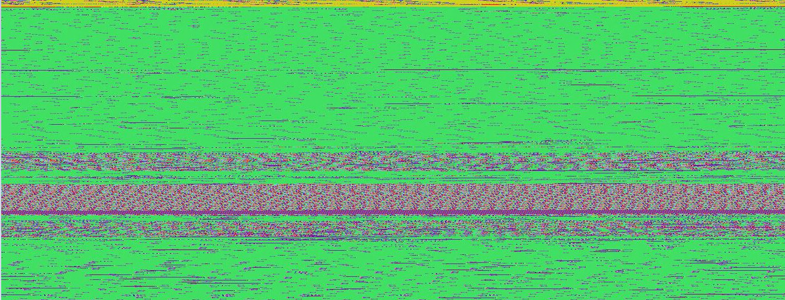
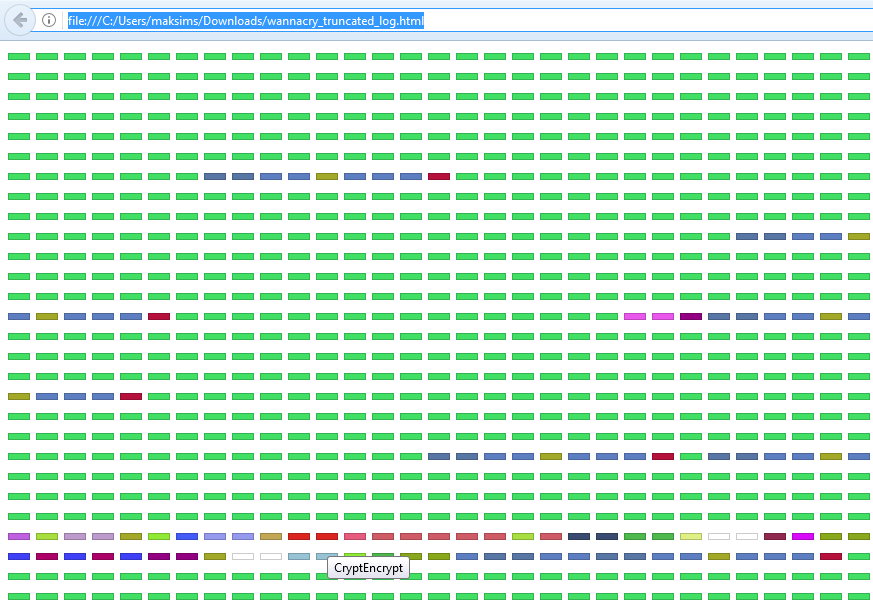

# Drltrace
Drltrace is a dynamic API calls tracer for Windows and Linux applications designed primarily for malware analysis. Drltrace is built on top of [DynamoRIO](http://www.dynamorio.org/) dynamic binary instrumentation framework. The release build can be downloaded [here](https://github.com/mxmssh/drltrace/releases).

# Usage
The usage of drltrace is very simple. A user needs to specify a log directory and a name of a target process in the following way:
```
drltrace -logdir . -- calc.exe
```
That’s all, the tool will inject required DLLs in the target process, starts instrumentation and in parallel will log information about all library calls which are executed in the target process:

```
~~43600~~ msvcrt.dll!__wgetmainargs
    arg 0: 0x010d2364
    arg 1: 0x010d2368
    and return to module id:0, offset:0x193a
~~43600~~ ntdll.dll!EtwEventRegister
    arg 0: 0x002ff994
    arg 1: 0x010d1490
    and return to module id:0, offset:0x157e
~~43600~~ ntdll.dll!EtwEventSetInformation
    arg 0: 0x007b4b40
    arg 1: 0x00000033
    and return to module id:0, offset:0x15a1
~~43600~~ SHELL32.dll!ShellExecuteW
    arg 0: <null> (type=<unknown>, size=0x0)
    arg 1: <null> (type=wchar_t*, size=0x0)
    arg 2: calculator:// (type=wchar_t*, size=0x0)
    arg 3: <null> (type=wchar_t*, size=0x0)
    arg 4: <null> (type=wchar_t*, size=0x0)
    arg 5: 0x1 (type=int, size=0x4)
    and return to module id:0, offset:0x167d
```
The format of the output is simple and can be easily parsed by an external script:
```
~~[thread id]~~ [dll name]![api call name]
arg [arg #]: [value] (type=[Windows type name], size=[size of arg])
and return to module id:[module unique id], offset:[offset in memory]
```
The module unique identifiers table is printed at the end of the log file:
```
Module Table: version 3, count 70
Columns: id, containing_id, start, end, entry, checksum, timestamp, path
  0,   0, 0x010d0000, 0x010da000, 0x010d1b80, 0x0000f752, 0xb5fe3575,  C:\Windows\SysWOW64\calc.exe
  1,   1, 0x6d4c0000, 0x6d621000, 0x6d563940, 0x00136d65, 0x59ce1b0b,  C:\Users\Max\Downloads\drltrace\drltrace\dynamorio\lib32\release\dynamorio.dll
  2,   2, 0x73800000, 0x73975000, 0x7380dbf7, 0x00000000, 0x59ce1b0f,  C:\Users\Max\Downloads\drltrace\drltrace\bin\release/drltracelib.dll
  3,   3, 0x742f0000, 0x742fa000, 0x742f2a00, 0x0000c877, 0x0adc52c1,  C:\Windows\System32\CRYPTBASE.dll
  4,   4, 0x74300000, 0x74320000, 0x7430c9b0, 0x0002c617, 0x245970b4,  C:\Windows\System32\SspiCli.dll
  5,   5, 0x74410000, 0x74431000, 0x74416900, 0x0002a940, 0x88a53c1d,  C:\Windows\System32\GDI32.dll
  6,   6, 0x74440000, 0x74500000, 0x7446fb20, 0x000cc410, 0xd343d532,  C:\Windows\System32\RPCRT4.dll
  7,   7, 0x74500000, 0x74525000, 0x745047d0, 0x00026737, 0xa39c8991,  C:\Windows\System32\IMM32.DLL
  8,   8, 0x74550000, 0x745c7000, 0x7456e8a0, 0x00081857, 0x73b971e1,  C:\Windows\System32\advapi32.dll
  9,   9, 0x748f0000, 0x74929000, 0x748febd0, 0x00045303, 0xa58be652,  C:\Windows\System32\cfgmgr32.dll
 10,  10, 0x74930000, 0x75c78000, 0x74aa09d0, 0x01377aa6, 0x4b39926b,  C:\Windows\System32\SHELL32.dll
```

Drltrace can easily filter out interlibrary calls and print only API calls performed from the main module (or from a heap) of a target application by specifying ```-only_from_app``` option which is very useful in case of applications that generate huge logs. Drltrace also has several useful external scripts to filter API calls for certain library, print only potentially interesting API calls and strings.

# License

Drltrace and DynamoRIO are distrubuted under BSD.

Some additional modules required for drltrace are distrubuted under LGPL. See source files for more details.

# Motivation
Malware analysis is not an easy task. Sophisticated software packers like Themida and Armadillo and of course dozens of unnamed packers written by malware authors plus code & data encryption significantly facilitate (in some cases making it completely impossible) static reverse engineering of such samples making life of malware analysts complicated. In such case, API calls tracing can significantly reduce amount of time required to understand an actual malicious intent and reveal a lot of technical details about protected malicious code.

While traditional technique of API-hooking was successfully implemented in several solutions, the approach is well studied by malware authors and can be easily detected and/or bypassed. Moreover, these tools are distributed as standalone heavy-weight GUI applications (as proprietary products) which are not often easy to integrate within existent malware analysis workflow.

If we look on Linux world, there is a wonderful tool called [ltrace](https://linux.die.net/man/1/ltrace). Using a single bash command, we can easily get the full trace of API calls of a certain executable. 

**Why don’t we have such tool (like ltrace in Linux) for Windows which is also transparent against anti-research tricks used by modern malware?**

It turns that there is a technique that can help us to have such tool for Windows and trace API calls transparently towards executed program. This technique is called dynamic binary instrumentation aka DBI. DBI is a technique of analyzing the behavior of a binary application at runtime through the injection of instrumentation code.

However, application of DBI for malware analysis is undeservedly limited by unpacking automatization and several proofs of concepts for instructions, basic blocks and function calls tracing. As far as we know, drltrace is a first tool for API calls tracing based on DBI which can be used in practice for malware analysis. We provided several malware analysis examples in our [wiki](https://github.com/mxmssh/drltrace/wiki/Malware-Analysis-Examples) where we described how drltrace allowed to revel in several minutes a lot of internal technical details about sophisticated malicious samples without even starting IDA or debugger.

# Why Drltrace Rock ?
- Fast enough to perform analysis of malicious samples without being detected by time-based anti-research techniques.
- Supports both x86 and x64 (ARM in future).
- Supports both Windows and Linux (macOS in future).
- Supports self-modifying code.
- Supports all types of library linkage (static and dynamic).
- Not-detectable by standard anti-research approaches (anti-hooking, anti-debugging and anti-emulation).
- User can easily add a new function prototype to tell drltrace how to print more details about previously unknown API calls (even about non-system DLLs). External configuration file is used.
- Easy-to-use and modify for your own purposes (no additional package requirements, no heavy-weight GUI interface).
- Open-source, code is clear and well-documented. You can freely build & use your own advanced solution on top of drltrace.

# Command line options
```
 -logdir              [     .]  Log directory to print library call data
 -only_from_app       [ false]  Reports only library calls from the app
 -follow_children     [  true]  Trace child processes
 -print_ret_addr      [ false]  Print library call's return address
 -num_unknown_args    [     2]  Number of unknown libcall args to print
 -num_max_args        [     6]  Maximum number of arguments to print
 -default_config      [  true]  Use default config file.
 -config              [    ""]  The path to custom config file.
 -ignore_underscore   [ false]  Ignores library routine names starting with "_".
 -only_to_lib         [    ""]  Only reports calls to the library <lib_name>.
 -help                [ false]  Print this message.
 -version             [ false]  Print version number.
 -verbose             [     1]  Change verbosity.
 -use_config          [  true]  Use config file
 ```
# Configuration file syntax
Drltrace supports external configuration files where a user can describe how drltrace should print arguments for certain API calls.
```
HANDLE|CreateRemoteThread|HANDLE|SECURITY_ATTRIBUTES*|size_t|THREAD_START_ROUTINE*|VOID*|DWORD|__out DWORD*
```
Each function argument should be separated by ```|```. The first argument is return type, the second argument is a function name itself and the rest are the function arguments. A token ```__out``` is used to mark output arguments and ```___inout``` is used to mark input+output arguments.

# Malware Analysis Examples

You can find examples of how to use drltrace for analysis of complex malware at our [Wiki page](https://github.com/mxmssh/drltrace/wiki/Malware-Analysis-Examples).

# Log Visualization

To make the work with log files easier, we have implemented a script called ```api_calls_viz.py``` which can be used to generate RGB images where each pixel color represents unique API call. For example, the picture below represents log file of WannaCry malware.



The large green areas on the picture represent API calls (```wcscmp/wcsicmp```) which are used to select files with interesting extensions (e.g. docx, xls, py) to encrypt them. The purple areas represent API calls (```FindFirstFile/FindNextFile/CryptEncrypt```) which are used to enumerate and encrypt files and folders on the disk.

The script can also generate an HTML representation of generated RGB image where each element can be selected to show a name of API call. 



[Raw HTML File](pictures/wannacry_truncated_log.html).

See the ```api_calls_viz``` [directory](https://github.com/mxmssh/drltrace/tree/master/api_calls_viz) for more details.

# How to Build
You can find a detailed manual at this [Wiki page](https://github.com/mxmssh/drltrace/wiki/How-To-Build).

# OS Support
Windows, Linux (macOS in future).

# CPU Architectures Support
x86, x64 (ARM on the list).

# Languages
C and C++ standard library (and logs handling scripts written in Python).

# Technical Details

We decided to implement our API calls tracer on top of dynamic binary instrumentation framework [DynamoRIO](http://www.dynamorio.org/). Drltrace asks DynamoRIO to perform instrumentation of LoadLibrary call to be able to handle new libraries being loaded by the target process. When the process tries to load a new library, DynamoRIO redirects control flow to ```drltracelib.dll```. In turn, drltrace enumerates exported functions in the newly loaded DLL and registers a special callback for each of them. Thus, if some exported function would be called by malware, drltrace’s callback will be executed before this function and the tool will be able to log all required information such as a function name and arguments. Another callback might be registered after the function to save results of execution.

Why not Intel Pin ? We decided to use DynamoRIO motivated by the following reasons:

1.	The source code of DynamoRIO is available on github.com and distributed under BSD license while Intel Pin is a proprietary software.
2.	One of the basic requirements for DynamoRIO at the time of development was transparency towards the instrumented executable.
3.	DynamoRIO uses different technology of instrumentation based on code transformation while Intel PIN uses special trampolines which is not transparent towards analyzed executable and might be detected by malware.

# Future Work
1. While drltrace is not detectable by standard anti-research tricks, DBI-engine itself can be detected as shown in these works [1](https://www.youtube.com/watch?v=VGmvx2B5qdo), [2](https://recon.cx/2012/schedule/events/216.en.html). Making DynamoRIO resistant against these tricks is important path for future work.
2. Currently, drltrace prints a raw log and provides several scripts to print important strings and library calls. In future, we plan to add heuristics (probably by applying YARA rules) to be able to select indicative behavior from malware automatically.
2. Currently, DynamoRIO has beta support of ARM architecture, testing and porting drltrace on ARM is required.
3. Drltrace doesn’t support situation when malware injects code in a remote process. In such cases, it is possible to tell DynamoRIO inject drltrace in all newly created processes (```-syswide_on``` option of ```drrun.exe```). However, in future, it is necessary to implement a special support in drltrace for such situations.

Our issue tracker contains more details about future of drltrace.

# Acknowledgments
Maksim Shudrak https://github.com/mxmssh

Derek Bruening https://github.com/derekbruening
